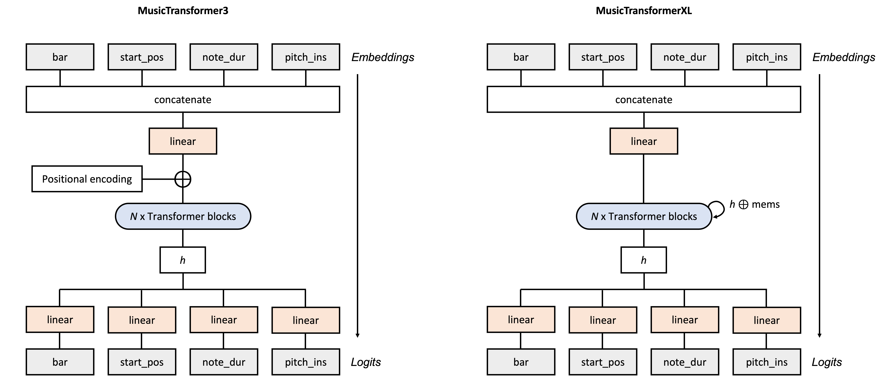

# LLM-usicProducer
Attempt at creating a transformer capable of symbolic music generation. Focussing on creating a single drum track, piano (or keys equivalent) track and a bass.

## Contents
[**Examples of Generated MIDI Files**](https://github.com/dropthejase/LLM-usicProducer#examples-of-generated-midi-files)

  &ensp; &ensp; [Inference from Scratch](https://github.com/dropthejase/LLM-usicProducer#inference-from-scratch)

  &ensp; &ensp; [Inference with Prompt](https://github.com/dropthejase/LLM-usicProducer#inference-with-prompt)

[**Quickstart**](https://github.com/dropthejase/LLM-usicProducer#quickstart)

  &ensp; &ensp; [Download Model](https://github.com/dropthejase/LLM-usicProducer#download-model)

  &ensp; &ensp; [Inference from Scratch](https://github.com/dropthejase/LLM-usicProducer#inference-from-scratch-1)

  &ensp; &ensp; [Inference with Prompt](https://github.com/dropthejase/LLM-usicProducer#inference-with-prompt-1)

[**Motivation**](https://github.com/dropthejase/LLM-usicProducer#motivation)

[**Tokenization Methodology**](https://github.com/dropthejase/LLM-usicProducer#tokenization-methodology)

  &ensp; &ensp; [Why use pooled embeddings?](https://github.com/dropthejase/LLM-usicProducer#why-use-pooled-embeddings)

[**Data**](https://github.com/dropthejase/LLM-usicProducer#data)

[**Transformer Setup**](https://github.com/dropthejase/LLM-usicProducer#transformer-setup)

[**Instructions**](https://github.com/dropthejase/LLM-usicProducer#instructions)

[**Next Steps**](https://github.com/dropthejase/LLM-usicProducer#next-steps)

[**License / Attribution**](https://github.com/dropthejase/LLM-usicProducer#license--attribution)

[**Acknowledgements**](https://github.com/dropthejase/LLM-usicProducer#acknowledgments)

[**References**](https://github.com/dropthejase/LLM-usicProducer#references)

## Examples of Generated MIDI Files
[Back to Contents](https://github.com/dropthejase/LLM-usicProducer#contents)

Showcasing some of my favourite generated samples! You'll notice that they tend to 'forget' or 'lose context' after a while but it's a really cool achievement nonetheless!

I used a few Kontakt libraries for the sounds: Studio Drummer (drums), Mark II Classic (bass) and Alicia Keys (piano). I slapped on some reverb and delay, and did some slight EQ-ing with the MH Channelstrip. I then ran everything through a mix buss chain and brought the volume up with Waves L2.

You can find them in the <a href="https://github.com/dropthejase/musicllm/tree/main/fav_samples">'fav_samples'</a> folder

### Inference from Scratch (MusicTransformer3 model)
See the 'fromscratch' MP3 files in the <a href="https://github.com/dropthejase/musicllm/tree/main/fav_samples">'fav_samples'</a> folder.

I've noticed that some of these generated samples might simply be playing training data - e.g. sample 3 is ABBA's Money Money Money! Hopefully this isn't the case with the other two samples (although I'm unable to recognise it).

### Inference with Prompt (Music Transformer3 model)
(Again, refer to the <a href="https://github.com/dropthejase/musicllm/tree/main/fav_samples">'fav_samples'</a> folder)

I've noticed that when using prompts, the LLM does not seem to perform as well, with the model often simply repeating what was before. The coherence of what is generated is also inconsistent. I suspect that prompts that are more repetitive (and perhaps less rhythmically and melodically diverse) may lend itself to more coherent inferences.

**Example 1 ('Concrete Jungle Island Life' by Shiv & Jason)**

An example of the model not working very well.
The model starts off repeating some of the previous riff before descending into madness!

**Example 2 ('Live Again' by MBI and Jason - unreleased)**

A good example of the model working nicely

## Quickstart
[Back to Contents](https://github.com/dropthejase/LLM-usicProducer#contents)

See 'samples' folder for examples of generated samples from scratch.

After creating a virtual environment, cloning the repo, and installing dependencies from `requirements.txt`, do the following:

> **Note** 
>
>If you are having issues with `miditoolkit`, navigate to `.venv/lib/python3.10/site-packages/miditoolkit/midi/parser.py` (or your virtual env equivalent) and replace `np.int` with `int` on **line 205**.

### Download Models
Download the pooled embedding model for MusicTransformer3 <a href="https://drive.google.com/file/d/18s_Es63QMqT9htQZ1FpUQvFGmPjdUj1L/view?usp=sharing">here</a>, or MusicTransformerXL <a href="https://drive.google.com/file/d/1v4lJYCrpKVEs1RbqTCQ_ZlQ3uuw2fq0H/view?usp=sharing">here</a> into your working directory
* This model has been trained on 22 epochs - the folder will contain specific hyperparameters.
* Unfortunately the model's object name is called 'Transformer3' as I had experimented quite a few iterations beforehand

You can either follow the below instructions or import the functions within the relevant .py files into your own .py file if desired. The below instructions uses the command line interface.

> **Note** 
>
>It is recommended that you keep the length of your prompts (if using a prompt) `-pi` and number of new tokens generated `max_steps` to 512 tokens max. The models do not perform as well when you increase beyond this number.

### Inference from Scratch
~~~
python generate.py -mp <path/to/model.pth> -o <generated/samples/directory> -n <num_samples_to_generate> --genconfig <path/to/genconfig.json>
~~~
  Use the `-mp` option to specify the model path to either the MusicTransformer3 model or the MusicTransformerXL model
  You can create your own generation configurations in a .json file and specify its path using `--genconfig`
  Within your `genconfig.json` file, you can set the number of new tokens to make via the `num_bars` or `max_steps` keyword arguments. Essentially the model will either generate X `num_bars`(bars) of music or Y `max_steps` (depending on which gets reached first)

> **Note** 
>
>For Windows users, make sure to include `-d cpu`.

### Inference with Prompt
**Merge your drums, bass and piano .mid files.**

**Important:** Please make sure your .mid files adhere to the following:
* You should have up to three individual *single track* .mid files. They must be named either 'drums.mid', 'bass.mid' or 'piano.mid'. You don't have to have all three parts - for example, your prompt might only comprise a bass and piano.
* Your drum instruments should conform to the GM1 Sound Set (see https://www.midi.org/specifications-old/item/gm-level-1-sound-set). For example your kick should be either pitch35 or pitch36.
* Ticks per beat should be the same for all .mid files
~~~
python merge_midi.py <output directory for merged .mid file> <path/to/drums.mid> <path/to/bass.mid> <path/to/piano.mid> -n <merged_filename.mid>
~~~
Example:
~~~
python merge_midi.py test/merge_midi test/merge_midi/drums.mid test/merge_midi/bass.mid test/merge_midi/piano.mid -n mergedfile.mid
~~~
**Tokenize the .mid file(s)**
~~~
python tokenizer.py -p -td <output/directory/for/tokens> <path/to/.mid/files (or folder containing .mid files)>
~~~
Example
~~~
python tokenizer.py -p -td tokens_output dataset
~~~
But if you wish to use it in a separate .py file, simply import and call the Tokenizer:
~~~python
from tokenizer import MidiTokenizerPooled

tokenizer = MidiTokenizerPooled()
tokens = tokenizer("my_midi.mid")
print(tokens)
~~~
**Generate**
~~~
python generate.py -p <path/to/prompt.json> -pi <prompt_idx> -mp <path/to/model.pth> -o <generated/samples/directory> -n <num_samples_to_generate> --genconfig <path/to/genconfig.json>
~~~
  Use the `-p` option to specify the path to the tokenized prompt.json file
  You can use `-pi` to truncate your prompt (e.g. if you only want to use the first 50 tokens of a tokenized song)
  You can create your own generation configurations in a .json file and specify its path using `--genconfig`

## Motivation
[Back to Contents](https://github.com/dropthejase/LLM-usicProducer#contents)

Like many other music producers, I also struggle with writer's block. However, in the age of LLMs, I wanted to see if I could leverage generative AI to create ideas that might spark inspiration. In particular, I wanted to make something that was relatively lightweight, and had the ability to generate what are generally considered core 'parts' of a musical idea (e.g. the beat, bass, and a instrument that occupies the midrange / 'cushions' a vocal). Finally, I wanted the generated sample to be importable as stems.

Currently music transformers can either generate symbolically (e.g. generate MIDI sequences) or audio files. I believe symbolic music generation offers the following advantages:
* Unlike audio generation, MIDI generation leaves more freedom for the end user (a music producer or songwriter) to choose the specific sounds they would like to use for a MIDI sequence. This allows them to make use of their favourite VST instruments. Audio file manipulation can be more difficult - time stretching for example can introduce unpleasant artifacts.
* A MIDI file, even Type 1 (or multitrack) is easily importable to most digital audio workstations (DAWs). In particular, most DAWs will separate out the various instruments for you. With audio files however, it is much more difficult to isolate the various instruments into individual tracks (or 'stems').
* It is probably harder / more compute intensive to try and train audio data. For example one 3min MIDI file is often less than 50kB, whereas one audio file could be around 8MB (for MP3) or 32MB (for WAV). In addition, audio files might contain more 'noise' - for example, a recording of the same vocal can introduce have different frequency profiles depending on factors such as the room's reverb, distance of the singer from the mic, the mic model...etc.
* We can more easily represent MIDI data as words in the English dictionary. Given that the popular use case of LLMs are to do with language generation in one way or another (e.g. GPT, BERT...), one might naturally hypothesise that we could pivot slightly to train transformers on linguistic representations of music.

## Tokenization Methodology
[Back to Contents](https://github.com/dropthejase/LLM-usicProducer#contents)

Various different tokenization methodologies for MIDI exist, which can be summarised in the <a href="https://miditok.readthedocs.io/en/latest/tokenizations.html">MidiTok library</a>.

I decided to opt for a pooled embedding, drawing inspiration from MMT (Dong et al., 2022) and CP Word (Hsiao et al., 2021) in particular. However, I simplify the vocab list, stripping away 'nice-to-have' information such as:
* **Velocity:** i.e. how 'hard' a note is hit - if desired, the end user can alter velocity if humanisation is desired; DAWs such as Ableton allow for randomising velocity or introducing 'groove' to humanise MIDI tracks
* Any other attributes (beyond note duration) that describe how a note is played such as **after-touch** and **pitch bend** - these can be later controlled by the end user if desired
* **Time signature:** as we are keeping to 4/4 time
* **BPM:** possibly a debatable one but I felt that this was something the end user can ultimately adjust to taste; adding this might lead to increased complication such as double time
* **Any pieces with a ticks-per-beat not divisible by 8** - it just makes it harder for my tokenizer to tokenize and decode and I'm too lazy to try and solve for it :joy:

Essentially each token comprises an array with the following 'token families':

~~~
(bar, start_pos, note_dur, pitch_instrument)
~~~

...where:
* `bar` represents the bar number (from bar0 to 255, which should cover most 3-4min songs). Bar tokens also make it alot easier to tokenize and decode MIDI files. I've also found from previous experiments that it can help the model learn to 'move the music forward' rather than get stuck on the same bar.
* `start_pos` represents the start position of a note. Each bar is divided into 32 equally spaced possible start positions; my tokenizer will automatically quantise notes that do not conform to this
* `note_dur` represents note duration, up to 4 bars
* `pitch_instrument` represents a combination of pitch and instrument [^1]
  * Pitch ranges from 21 (A0) to 108 (C8) for bass and piano (the rationale being that it covers the range of an 88-key piano) [^2]
  * Pitch ranges 35 to 81 for drums per General MIDI 1 Sound Set

[^1]: When I did not combine instrument and pitch together, I found that because drums would often have (a high abundance) of repeated notes of the same pitch (corresponding to common parts such as the kick drum, snare and closed hihats), the model might generalise this to the piano and bass parts and cause them to continuously repeat notes that don't make harmonic 'sense' (unless when applied to drums). The opposite also happened where a wider range pitches typically characteristic of a piano part, would generalise to a drum part, leading to the drums playing a wide range of incoherent notes. Combining them together seemed to help prevent these.
[^2]: In hindsight, it may've been worth starting the ranges lower for the bass, as subbass parts could go down to C0. I could have also restricted the higher end of the bass pitch range.

### Why use pooled embeddings?
Pooled embeddings can offer advantages such as much shorter sequence lengths, enabling the model to attend to a larger context window. In addition, 'successive' or 'sequential' representations such as REMI (Huang & Yang, 2020) also requires the model to learn the order / format of these tokens. Indeed in one of my earlier 'proof-of-concept' tests where I tried a tokenization format of `bar start_pos note_dur pitch instrument` (this was before my pitch_instrument idea), I found that the model might apply the wrong order of tokens or miss one out entirely, creating errors when I try to reconvert the tokens back to MIDI.

However, the disadvantage with separating embeddings for each of these  is the inability for associations to be formed across the four token families. These associations can also carry useful information - for example, a kick drum (`pitch35_drum` or `pitch36_drum`) might typically occur on `start_pos`(-itions) corresponding to each quarter note.

## Data
[Back to Contents](https://github.com/dropthejase/LLM-usicProducer#contents)

The following datasets have been used, totalling around 11,000 songs:

### My own dataset
A bunch of my own songs for fun!

### Lakh MIDI Dataset (LMD-matched)
The <a href="https://colinraffel.com/projects/lmd/#get">Lakh MIDI Dataset (Raffel, 2016)</a> has been cleaned in the following ways:
* Removed songs without 4/4 time
* Removed songs with no drums
* Stripped midi such that there are only:
  * Three parts: drums, bass (programs 33-40) and piano (or piano equivalent)
  * The piano equivalent is based on a piano (programs 1-8) / guitar (25-32) / synth pads (89-96) / organs (17-24); if there are multiple candidates, then for simplicity, we take the instrument with the most notes

During tokenization, any further songs that create errors are removed. Typically this occurs when the MIDI has a pitch that is outside of the range of pitches available in our vocab list.

## Transformer Setup
[Back to Contents](https://github.com/dropthejase/LLM-usicProducer#contents)

I created two models: MusicTransformer3 and MusicTransformerXL. Both follow generally the same setup as described below. MusicTransformer3 uses standard decoder blocks with absolute positional encodings (Vaswani et al., 2017), whereas with MusicTransformerXL uses relative attention (Dai et al., 2019). With the latter, the hidden states are concatenated with their corresponding hidden states from the previous segment (the 'memory') before being fed into the decoder blocks. I used a max memory length of 512.

I use 12 transformer decoder blocks, each with 8 attention heads. Each token family has a separate embedding layer with different embedding dimensions (similar to Hsiao et al., 2021): 

| Token family | Vocab size | Embedding dimension |
| ------------ | ---------- | ------------------- |
| bar          | 260        | 512                 |
| start_pos    | 36         | 128                 |
| note_dur     | 132        | 256                 |
| pitch_instrument | 227    | 512                 |

Each embedding layer is then concatenated and linearly projected to layer with a *d_model* of 512. For MusicTransformer3, absolute positional encodings (Vaswani et al., 2017) are added here. Once data is passed through the transformer blocks, they are then linearly projected back to the four separate token families. Each output per token therefore comprises four logits.

All input sequences have been trimmed to a sequence length of 512

Loss is computed as an average cross entropy loss across the four token families (following Hsiao et al., 2021).

I use 90% of the dataset for training. I use a batch size of 12 and a learning rate of 0.5e-4.

MusicTransformer3 was trained for 22 epochs. MusicTransformerXL was trained for 15 epochs.

## Instructions
[Back to Contents](https://github.com/dropthejase/LLM-usicProducer#contents)

### Training
Download the <a href="https://drive.google.com/file/d/1lndqMBv1HTiTN0tZBNRYxZ46gKnLsdBe/view?usp=sharing">Lakh dataset</a> and save into working directory:
Note I have removed my own songs from this dataset - sorry!

#### Tokenize
Tokenize the .mid files.
~~~
python tokenizer.py -td <output/directory/for/tokens> <path/to/.mid/files (or folder containing .mid files)>
~~~
Alternatively download the tokenized .json files <a href="https://drive.google.com/file/d/1JfK1jL_C_NDzg-Pu5VtA2eA_3QBdjimz/view?usp=sharing">here</a> (note only pooled embedding tokenization currently available)

If you wish to use my tokenizer in a separate .py file, simply import and call the desired MidiTokenizerBase object:
~~~python
from tokenizer import MidiTokenizerPooled

tokenizer = MidiTokenizerPooled()
tokens = tokenizer("my_midi.mid")
print(tokens)
~~~
#### Prepare Dataset
We will create a Dataset object and save this locally for future reloading. Rather simplicistically, this creates a PyTorch tensor of N x block_size dimensions, with the last row deleted if not filled up (i.e. there is basically no padding involved).
~~~
python prepare.py <output_filename.pt> -b <block_size> -fp <path/to/tokens/folder>
~~~
#### Train
~~~
python train_pool.py
~~~
* Use `-xl` if you want to train a MusicTransformerXL model from scratch, otherwise it will default to creating a MusicTransformer3 model
* Use `--dataset_path <path/to/dataset.pt>` to specify path of Dataset object (by default it will look for 'dataset_pitch_ins512.pt' in your working directory)
* You can specify the model's configurations using `--model_config` and providing the path to the model_config.json file
* You can do the same with the training arguments using `--training_args`, speciying the path to the training_args.json file
* Use `--train_split` followed by a `float` number to specify train split
* Use `-fp` followed by the path to your .pth model if you wish to load a pretrained model or checkpoint - this can be either a MusicTransformer3 or MusicTransformerXL model

### Generate
See 'Quickstart' above

## Next Steps
[Back to Contents](https://github.com/dropthejase/LLM-usicProducer#contents)

I have several ideas on where to take this project forward:
1. Retry training without pooled embeddings using Transformer-XL (which could provide for attention towards wider context length)
2. Recreate the model but have more instrument groups, e.g. drums, percussion, bass, piano, synth leads, synth pads, guitars
3. Retrain the model using crowdsourced music - anyone want to contribute? :grin: (Send me a DM)

## License / Attribution
[Back to Contents](https://github.com/dropthejase/LLM-usicProducer#contents)

The Lakh MIDI Dataset which was used to train this model is distributed with a CC-BY 4.0 license. Find out more via: https://creativecommons.org/licenses/by/4.0/ and https://colinraffel.com/projects/lmd/#license. Please seek legal advice if you wish to use this for commercial use - I will not be held responsible for any infringements or legal liabilities that may arise due to your use of the model or its underlying dataset.

## Acknowledgments
[Back to Contents](https://github.com/dropthejase/LLM-usicProducer#contents)

<a href="https://github.com/salu133445/mmt/tree/main">Dong et al., 2022</a> and <a href="https://github.com/YatingMusic/compound-word-transformer/tree/main">Hsiao et al., 2021</a> whose experiments showed that pooled embeddings could work, and also for the (relatively) easily understandable code (which I used alot for reference)!

<a href="https://github.com/YatingMusic">YatingMusic</a> for the amazing `miditoolkit` library

<a href="https://github.com/lucidrains">lucidrains</a> for equally amazing the `x-transformers` library

## References
[Back to Contents](https://github.com/dropthejase/LLM-usicProducer#contents)

**Dai, Z., Yang, Z., Yang, Y., Carbonell, J., Le, Q. V., Salakhutdinov, R. (2019).** Transformer-XL: Attentive Language Models Beyond a Fixed-Length Context. ArXiv:1901.02860. https://arxiv.org/abs/1901.02860

**Dong, H.-W., Chen, K., Dubnov, S., McAuley, J., & Berg-Kirkpatrick, T. (2022).** Multitrack Music Transformer: Learning Long-Term Dependencies in Music with Diverse Instruments. ArXiv:2207.06983 [Cs, Eess]. https://arxiv.org/abs/2207.06983

**Hsiao, W.-Y., Liu, J.-Y., Yeh, Y.-C., & Yang, Y.-H. (2021).** Compound Word Transformer: Learning to Compose Full-Song Music over Dynamic Directed Hypergraphs. ArXiv:2101.02402 [Cs, Eess]. https://arxiv.org/abs/2101.02402

**Huang, Y.-S., & Yang, Y.-H. (2020). Pop Music Transformer.** Proceedings of the 28th ACM International Conference on Multimedia. https://doi.org/10.1145/3394171.3413671

**Raffel, C. (2016)** "Learning-Based Methods for Comparing Sequences, with Applications to Audio-to-MIDI Alignment and Matching". PhD Thesis. https://colinraffel.com/publications/thesis.pdf

**Vaswani, A., Shazeer, N., Parmar, N., Uszkoreit, J., Jones, L., Gomez, A. N., Kaiser, L., & Polosukhin, I. (2017).** Attention Is All You Need. ArXiv.org. https://arxiv.org/abs/1706.03762
